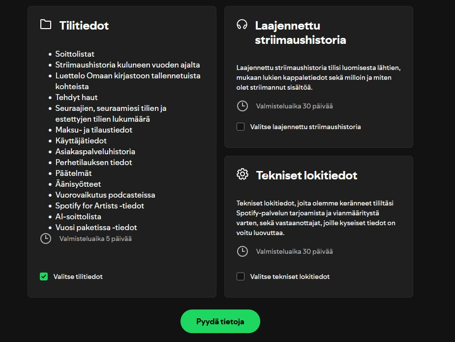
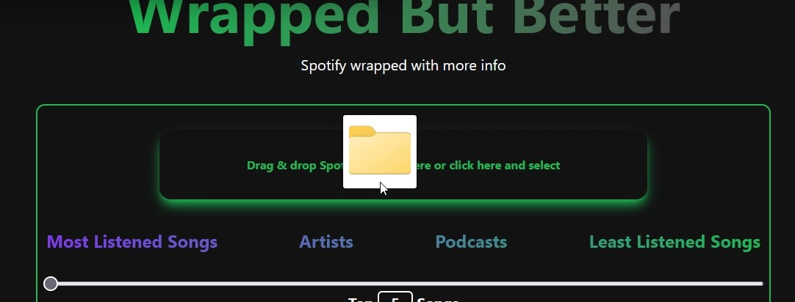

# Spotify-musiikkianalyysi

Tämä projekti mahdollistaa Spotify-käyttäjän henkilökohtaisen musiikkianalyysin. Käyttäjä voi ladata Spotifysta saamansa kuunteluhistorian Zip-tiedostona ja pudottaa sen suoraan sovellukseen. Sovellus analysoi tiedot ja näyttää visuaalisesti tärkeimmät musiikkitilastot, kuten:

- Kappaleiden, artistien ja podcastien kuunteluaika
- Kuuntelukerrat

**Käytetyt teknologiat:**  
React TypeScript, Tailwind CSS & Java SpringBoot

---

## Käyttöohjeet

### 1. Hanki henkilökohtainen data

Pyydä Spotifylta henkilökohtainen data kohdasta [Spotify Privacy](https://www.spotify.com/fi/account/privacy/).

---

### 2. Odota sähköposti-ilmoitusta

Saat ilmoituksen sähköpostiisi 2-5 päivän kuluessa, jolloin voit käydä lataamassa datan.

---

### 3. Lataa ja avaa tiedosto

- Avaa ladattu **my_spotify_data.zip**-tiedosto.
- Tiputa sen sisällä oleva "Spotify Account Data" -tiedosto sovelluksen tiedoston tiputuskenttään.

---

### 4. Sovelluksen toiminta

Sovellus lähettää tiedoston backendille, joka käsittelee datan ja palauttaa REST-rajapinnan kautta tarvittavat tiedot. Näitä tietoja käytetään sovelluksessa seuraavien tilastojen visualisointiin:

- Kuunteluaika
- Kuuntelukerrat
- Podcast- ja artistitilastot

---
